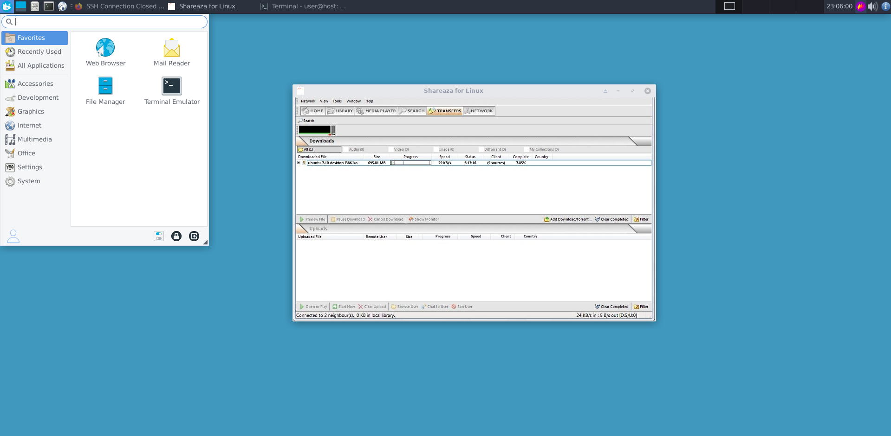

# Shareaza for Linux


## Overview

**Shareaza for Linux** is a student-led adaptation of the popular Shareaza P2P application for the Linux platform. While the project maintains core functionality and has undergone testing to ensure stability, some features may contain bugs due to limited development time. Despite this, the application provides a reliable and functional experience for users looking to explore Shareaza's capabilities on Linux. Contributions are welcome to help refine and expand the project!

## Features

- **Multi-network Support**: Connect to multiple P2P networks like Gnutella, Gnutella2, eDonkey2000, and BitTorrent.
- **User-friendly Interface**: A polished and intuitive interface built using Linux-native libraries.
- **Cross-platform Compatibility**: Sync and share files with other Shareaza users on Windows or Linux.
- **Customizable Settings**: Fine-tuned controls for bandwidth, downloads, and sharing preferences.
- **Security Enhancements**: Integrated support for IP filtering and encrypted connections.

## Screenshot

 

## Installation

To install one of the precompiled packages, consult your distribution's 
documentation.  

To compile gtk-gnutella, first make sure the following packages are installed:

```text
make g++ libglib2.0-dev zlib1g-dev libgtk2.0-dev
```

so if you never compiled a C++ source code or if you have freshly installed your GNU/Linux OS you should run:

```bash
$ sudo apt install make g++ libglib2.0-dev zlib1g-dev libgtk2.0-dev
```


When all required packages are installed, run:

```bash
./build.sh
```

At the end, build.sh will output the command to run to install gtk-gnutella.
Usually it will be "make install" but it could be "gmake install" on some
systems where "make" is not the default.

The build.sh shell script is a wrapper for Configure. There should almost never
be a need to invoke Configure manually.  The `Configure' shell script attempts
to guess correct values for various system-dependent variables used during
compilation.  It uses those values to create a `Makefile' in each directory of
the package.  It may also create one or more `.h' files containing
system-dependent definitions.  Finally, it creates `config.sh' file that saves
the results of its tests to speed up reconfiguring, reusing your previous
values as defaults.  

## Run

```bash
./shareaza
```

## Bug reports

Report bugs to kernel at firemail.cc. 